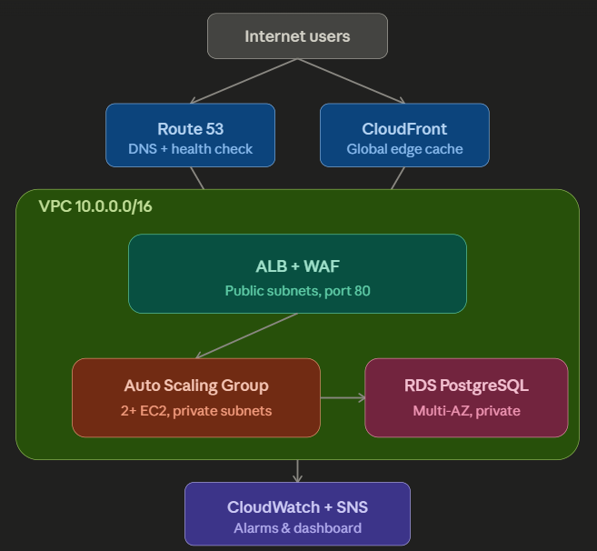
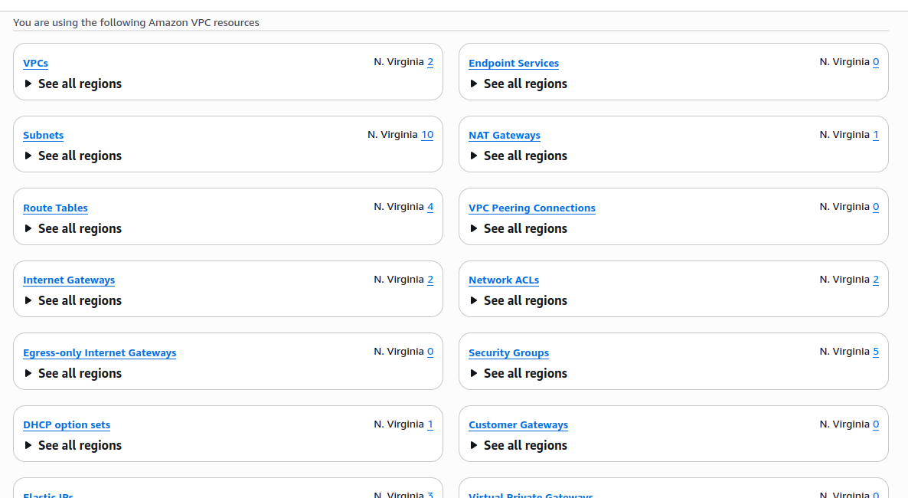
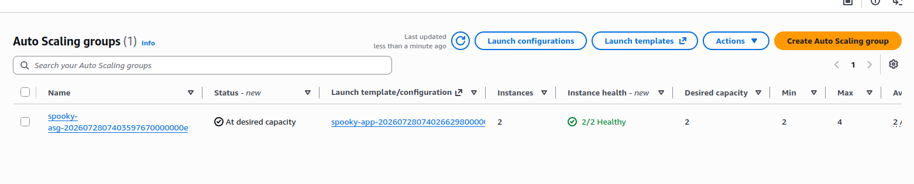
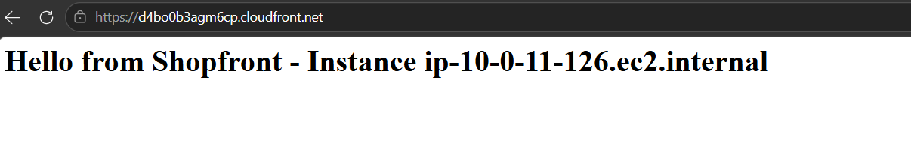
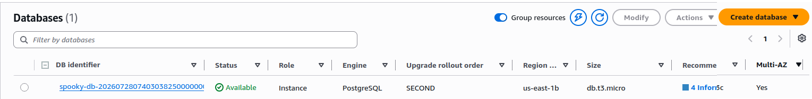
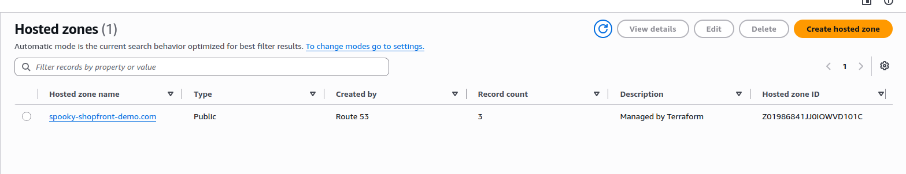
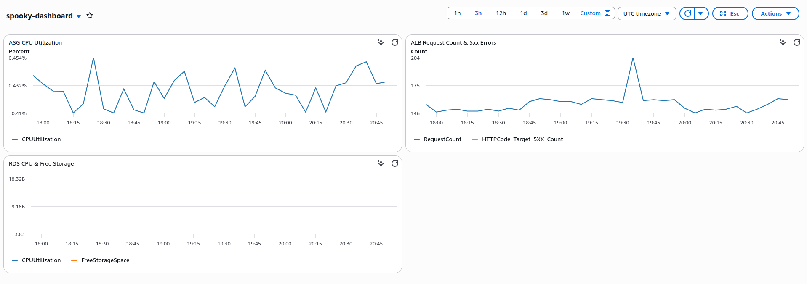

# Shopfront — Scalable Web Application on AWS

A production-representative, highly available web application architecture built entirely with Terraform, developed as a graduation project for the AWS Solutions Architect – Associate certification track.

## The story

Shopfront started as a single EC2 instance running an app. This project walks through the same evolution any growing system goes through — a server dies and takes the whole app down, so we need multiple Availability Zones; traffic spikes and one server can't keep up, so we need Auto Scaling; a public-facing app becomes a target, so we need a WAF; a single database instance is a single point of failure for the most critical asset — customer data — so we need Multi-AZ RDS. Each AWS service in this project exists because of a specific problem, not because it looked good on a resume.

Full write-up of that reasoning, chapter by chapter, is in [`docs/decisions.md`](docs/decisions.md).

## Architecture



**Request flow:** Internet users → Route 53 (DNS + health checks) / CloudFront (edge caching) → Application Load Balancer (behind AWS WAF) → Auto Scaling Group of EC2 instances in private subnets → RDS PostgreSQL (Multi-AZ, private subnets). CloudWatch and SNS monitor every layer. Administrative access to instances is via SSM Session Manager — no SSH, no bastion host, no open inbound ports on the app tier.

## AWS services used

| Service | Role in this project |
|---|---|
| VPC | Public/private subnets across 2 AZs, NAT Gateway, route tables, NACLs |
| EC2 + Auto Scaling Group | Launch Template with bootstrap script, target-tracking scaling policy |
| Application Load Balancer + WAF | Layer 7 routing, health checks, AWS managed rule set (OWASP Top 10) + rate limiting |
| CloudFront | Edge caching in front of the ALB |
| RDS (PostgreSQL, Multi-AZ) | Synchronous standby replica, automatic failover |
| Route 53 | Hosted zone, alias record, health check against the ALB |
| Systems Manager (Session Manager) | Bastion-free, IAM-controlled, CloudTrail-logged instance access |
| Secrets Manager | Auto-generated RDS credentials, never hardcoded |
| CloudWatch + SNS | Dashboard, 5 alarms across compute/app/database layers, email alerts |

## Repository structure

```
project1-scalable-webapp/
├── README.md
├── diagram/
│   └── architecture.png
├── docs/
│   └── decisions.md          # design tradeoffs + real debugging incidents
├── screenshots/
└── terraform/
    ├── providers.tf
    ├── variables.tf
    ├── main.tf
    ├── outputs.tf
    ├── terraform.tfvars      # not committed — contains alert_email
    └── modules/
        ├── vpc/
        ├── compute/
        ├── alb/
        ├── waf/
        ├── rds/
        ├── cloudfront/
        ├── route53/
        └── monitoring/
```

## Prerequisites

- Terraform >= 1.5
- AWS CLI v2, configured with an IAM user (not root) that has sufficient permissions
- An S3 bucket and DynamoDB table for Terraform remote state (created once, manually, before first use — see below)
- The [Session Manager plugin](https://docs.aws.amazon.com/systems-manager/latest/userguide/session-manager-working-with-install-plugin.html) installed locally, if you want to connect to instances via SSM

## One-time backend setup

Terraform's remote state backend can't create itself, so this is done manually, once:

```bash
aws s3api create-bucket --bucket <your-unique-bucket-name> --region us-east-1
aws s3api put-bucket-versioning --bucket <your-unique-bucket-name> --versioning-configuration Status=Enabled
aws s3api put-public-access-block --bucket <your-unique-bucket-name> \
  --public-access-block-configuration BlockPublicAcls=true,IgnorePublicAcls=true,BlockPublicPolicy=true,RestrictPublicBuckets=true

aws dynamodb create-table \
  --table-name <your-lock-table-name> \
  --attribute-definitions AttributeName=LockID,AttributeType=S \
  --key-schema AttributeName=LockID,KeyType=HASH \
  --billing-mode PAY_PER_REQUEST \
  --region us-east-1
```

Update the bucket/table names in `terraform/providers.tf` to match.

## Deploying

```bash
cd terraform
echo 'alert_email = "your-email@example.com"' > terraform.tfvars
terraform init
terraform plan
terraform apply
```

**Expect roughly 15–20 minutes total** for a full `apply` from scratch — most resources provision in seconds, but Multi-AZ RDS (5–10 min) and CloudFront (10–15 min) are both slow by nature. Everything else in the stack finishes quickly.

## Verifying it actually works

Every layer of this architecture was verified end to end during the build, not just deployed and assumed working:

1. **Compute + SSM:** `aws ssm start-session --target <instance-id>` connects with zero open inbound ports.
2. **ALB + WAF:** `curl http://<alb-dns-name>` returns the app response, load-balanced across both AZs.
3. **RDS security boundary:** confirmed the database port is reachable *only* from app instances, not from anywhere else in the VPC, by testing connectivity from inside an app instance via SSM.
4. **CloudFront:** `curl https://<distribution>.cloudfront.net` returns the app response over HTTPS via a global edge location.
5. **Route 53 health check:** confirmed `Success` status from 15 different AWS regions worldwide, polling the ALB directly.
6. **Monitoring:** CloudWatch dashboard populated with live ASG, ALB, and RDS metrics; SNS email subscription confirmed and alarms wired to it.

## Screenshots

| | |
|---|---|
| **VPC global view** |  |
| **4 subnets across 2 AZs** | .png) |
| **ASG — 2 healthy EC2 instances** |  |
| **ALB DNS response** |  |
| **RDS Multi-AZ enabled** |  |
| **CloudFront deployed** |  |
| **Route 53 hosted zone** |  |
| **CloudWatch dashboard** |  |

## Cost management

This project is built to be destroyed and rebuilt cheaply between work sessions:

- A CloudWatch billing alarm is set up before any infrastructure is created.
- `skip_final_snapshot = true` on RDS allows clean teardown without orphaned snapshots.
- The habit throughout the build: `terraform destroy` at the end of every session, `terraform apply` to bring it back — full rebuild takes under 20 minutes.
- Biggest cost drivers while running: NAT Gateway (~$1/day), Multi-AZ RDS (~$1–2/day depending on instance class), ALB (~$0.75/day). CloudFront, Route 53, and monitoring resources are all negligible in comparison.

See [`docs/decisions.md`](docs/decisions.md) for the full reasoning behind every cost/scope tradeoff made in this project, plus real debugging incidents encountered along the way (an SSM agent that wasn't actually pre-installed on the AMI, Terraform AMI drift, and a CloudWatch dimension mismatch that silently produced empty dashboard widgets) — the kind of things you only learn by actually building and breaking infrastructure, not by reading about it.
